# PairDev Manual

PairDev is a browser-based remote pair-programming tool for two people. It combines a shared code editor, driver and navigator roles, a shared terminal, a collaborative whiteboard, code annotation, GitHub import for public repositories, and session analytics.

## 1. Start a session

There are two ways to begin using PairDev:

- **Create a room** to start a new collaborative session.
- **Join a room** using a room code shared by another user.

  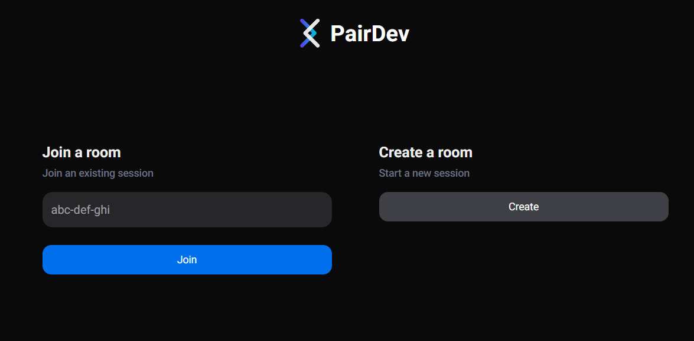

After selecting or creating a room, enter your display name.

- This name is shown to the other participant.
- It helps identify you in the people list, role controls, and live collaboration features.

  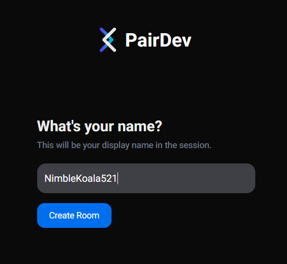

### Notes

- Room codes should follow the format `xxx-xxx-xxx`.
- PairDev shows an error toast if the room code format is invalid.
- PairDev also shows an error toast if the room does not exist yet.

  

  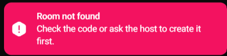

## 2. Understand the workspace

The main workspace is divided into four core areas:

- **Sidebar**
  - shows participants
  - opens analytics
  - opens settings
  - ends the session
- **Code editor**
  - main programming area
  - shared between participants
- **Terminal**
  - shows execution output
  - shared between participants
- **Collaborative whiteboard**
  - used for diagrams, sketches, and visual explanation

  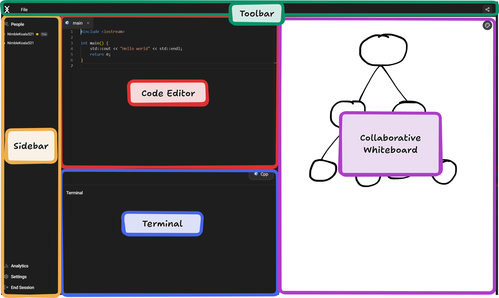

### What the top toolbar is used for

The toolbar gives access to important session actions, such as:

- running code
- sharing the invite link
- opening language-related controls

  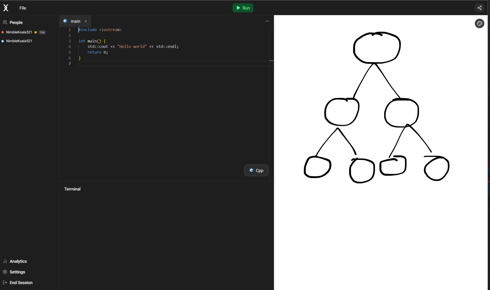

## 3. Understand roles

PairDev uses two main roles:

- **Driver**
  - can edit the code
  - is responsible for writing the code
- **Navigator**
  - cannot edit the code
  - reviews the work and guides the session

When your role changes, PairDev explains it through both a dialog and a toast.

  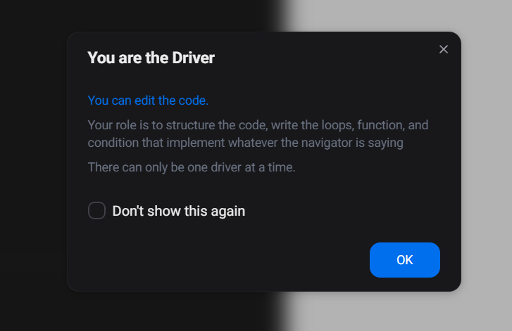

  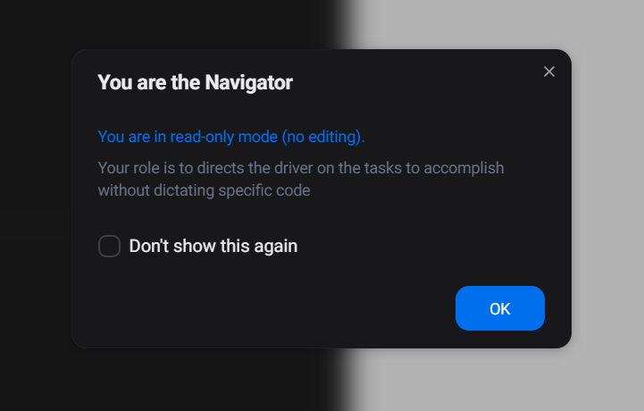

  

  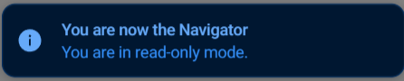

### Role rules

- Only the **room owner** can change roles.
- Only one participant can be the **driver** at a time.
- A navigator stays in **read-only** mode in the editor.

## 4. Collaborate in the editor

The code editor is the main work area.

- The **driver** writes and edits the code.
- The **navigator** sees updates in real time.
- Both participants can discuss the code while looking at the same shared document.

  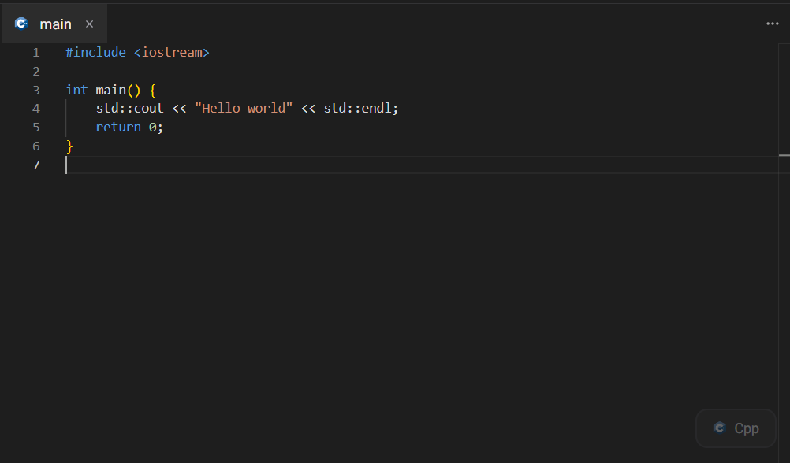

### Live collaboration cues

PairDev also shows live presence information in the editor, such as:

- the collaborator's cursor label
- text highlight around the active area
- visual indication of where the other participant is working

  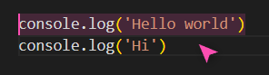

## 5. Use the participant list and follow mode

The people panel helps you understand who is in the room and who controls the session.

It shows:

- participant names
- the room owner
- your own identity
- whether follow mode is available

  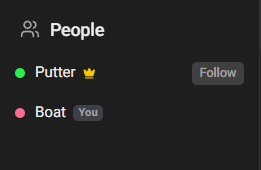

### Follow mode

When you are the **navigator**, you can use **Follow** to keep your editor view aligned with the driver.

This is useful when you want to:

- stay focused on the same part of the code
- avoid manually searching for the driver’s current location
- follow the flow of the session more easily

## 6. Select a language and run code

Before running code, choose the programming language from the language selector.

Supported languages include:

- JavaScript
- TypeScript
- Python
- Java
- C
- C++
- C#
- Go
- Rust
- Ruby
- PHP
- Bash

  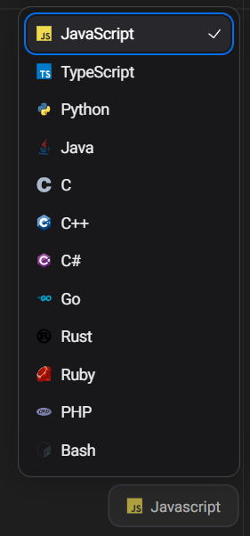

Then:

1. write code directly in the editor, or
2. import code from a public GitHub repository,
3. click **Run**.

The result appears in the shared terminal for both participants.

  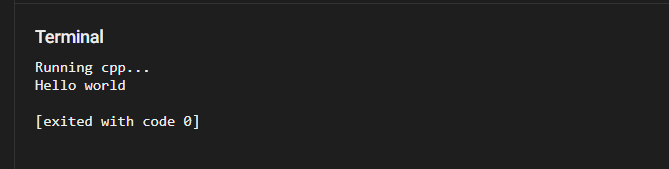

## 7. Use code annotation

Code annotation lets you draw directly over the editor.

Use it to:

- point out mistakes
- highlight important lines
- mark suspicious logic
- explain code visually during discussion

  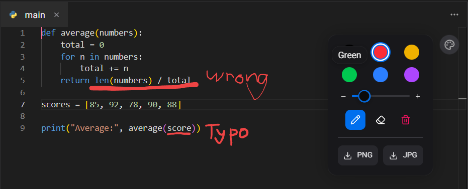

## 8. Use the collaborative whiteboard

The collaborative whiteboard is a separate shared space for drawing.

It is useful for:

- tree structures
- diagrams
- sketches
- algorithm explanations
- general visual discussion that does not need to sit directly on top of the code

  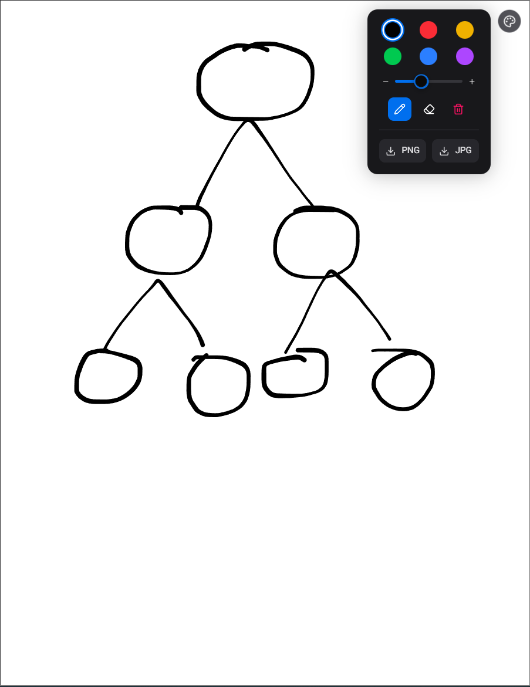

### Whiteboard tools

The whiteboard and annotation tools include:

- colour selection
- brush size control
- pen tool
- eraser tool
- clear action
- export to PNG
- export to JPG

  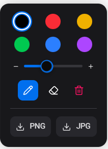

## 9. Open settings and manage roles

The settings modal provides both general preferences and room controls.

### General settings

From the general settings tab, you can change the visual theme:

- **Light mode**
- **Dark mode**
- **System**

  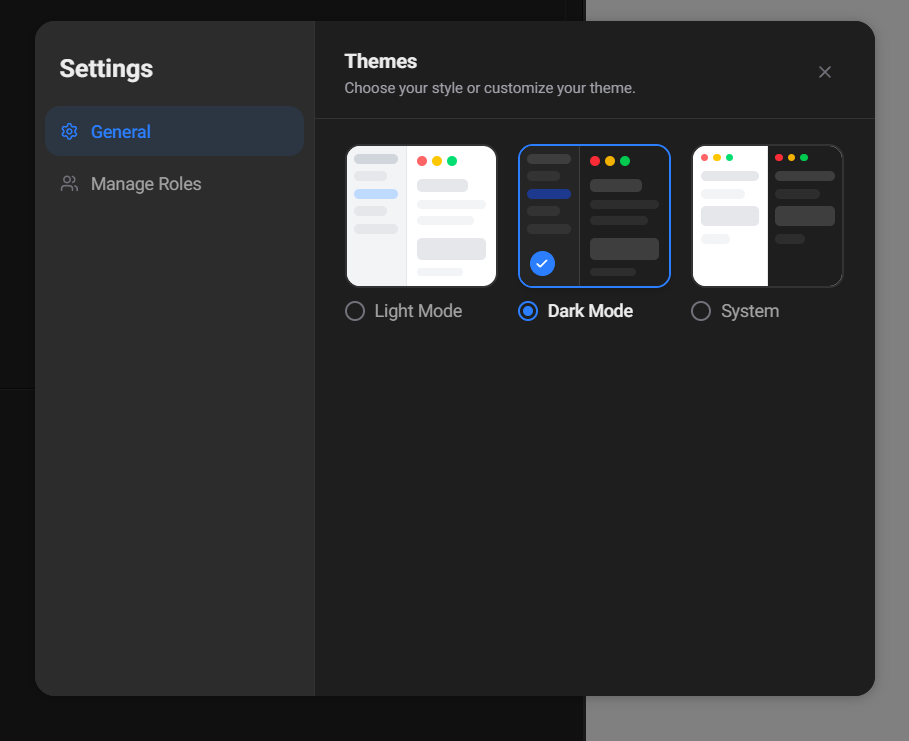

### Manage roles

From the manage roles tab, the room owner can:

- inspect current participants
- see who is the driver or navigator
- update roles during the session

  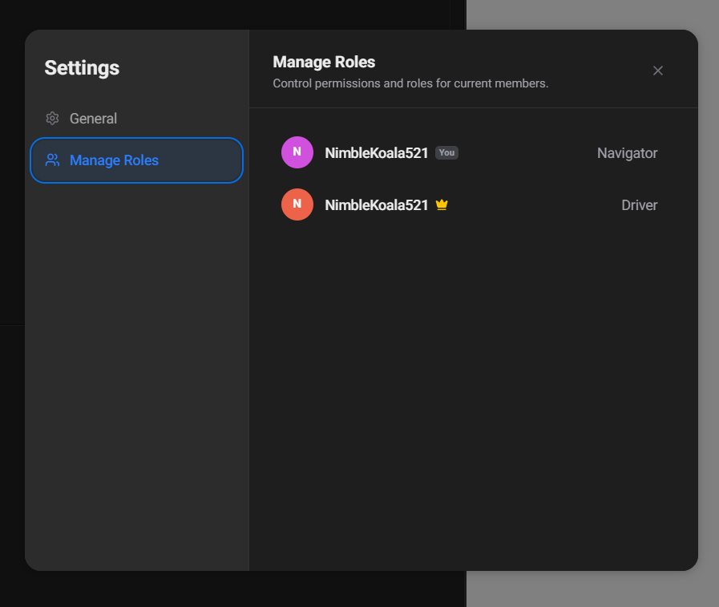

## 10. View analytics

PairDev provides a session summary after or during a session.

The analytics view shows:

- total session duration
- your active time
- time spent as driver
- time spent as navigator
- role contribution for participants

  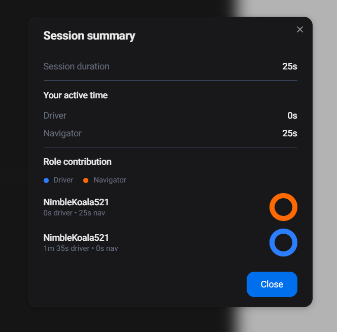

## 11. End the session

When the session is finished, the owner can end it for everyone.

Before the room closes, PairDev shows a confirmation dialog so that the action is not triggered accidentally.

  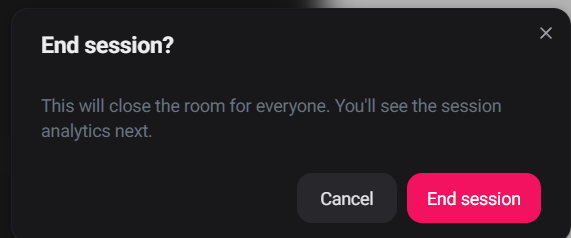

## 12. Quick tips

- Share the invite link after creating a room.
- Use the collaborative whiteboard for diagrams.
- Use the annotation tool for code-focused discussion.
- Use follow mode when the navigator wants to stay aligned with the driver.
- Check the participant list to confirm who is the owner and who is the driver.
- If GitHub import is used, only public repositories are supported.

## 13. Common issues

### I cannot edit the code

Possible reason:

- You are currently the **navigator**.

What to do:

- Ask the owner to switch your role to **driver**.

### The room does not open

Possible reasons:

- The room code format is invalid.
- The room does not exist yet.

What to do:

- Check the room code.
- Ask the host to create the room again.

### GitHub import does not work

Possible reasons:

- The repository is private.
- The URL is invalid.

What to do:

- Make sure the repository is public.
- Check that the GitHub URL is correct.

### I lost ownership after reopening

Possible reason:

- Ownership recovery depends on the current browser session.

What to do:

- Reopen the room in the same browser session if possible.
- Avoid clearing session data during an active session.
